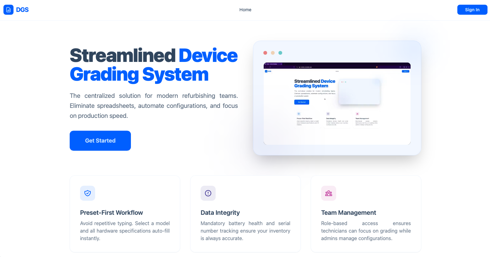
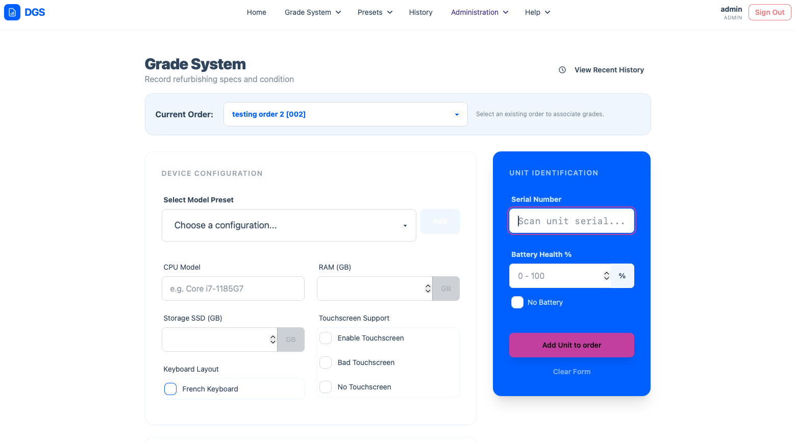
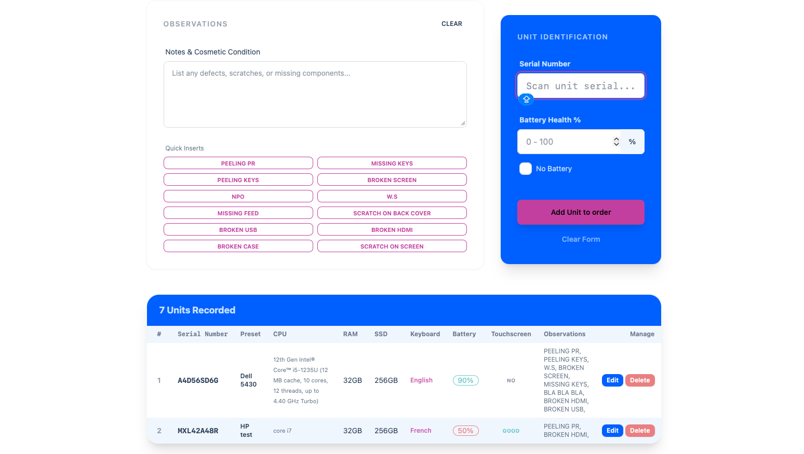
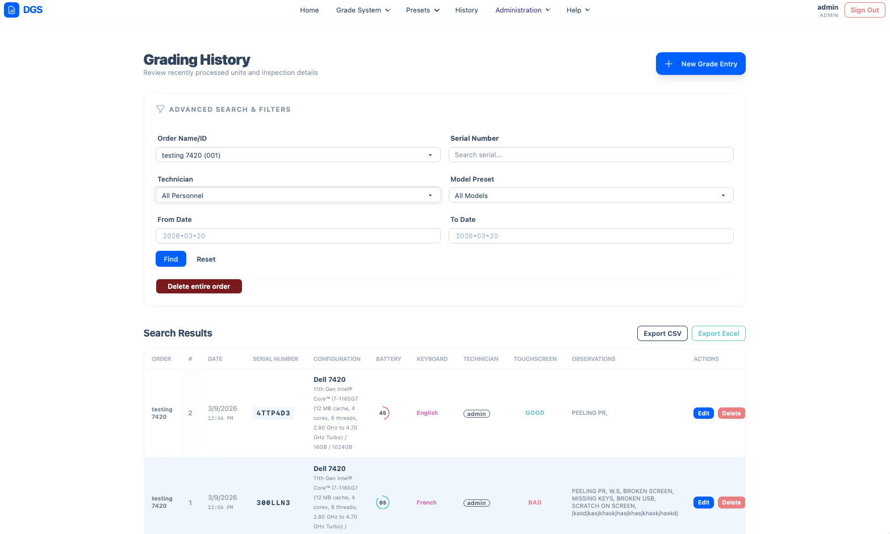
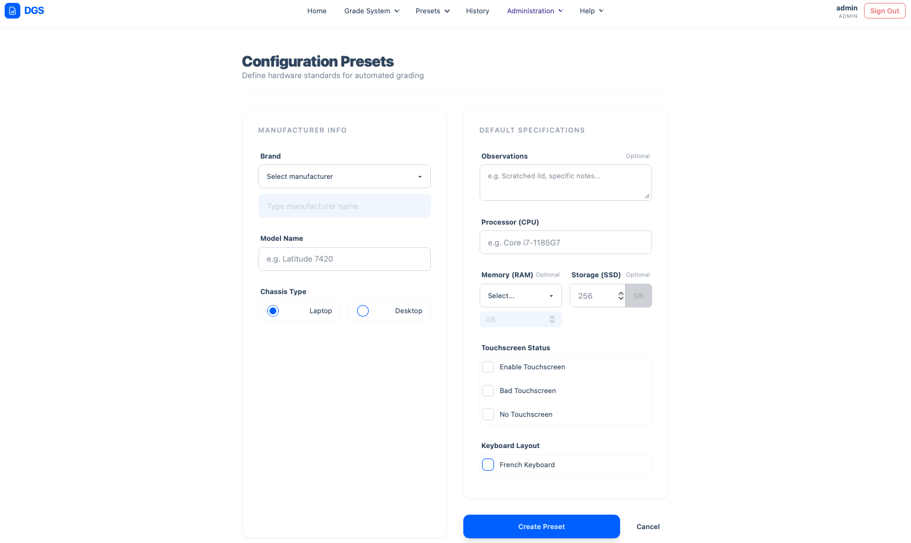
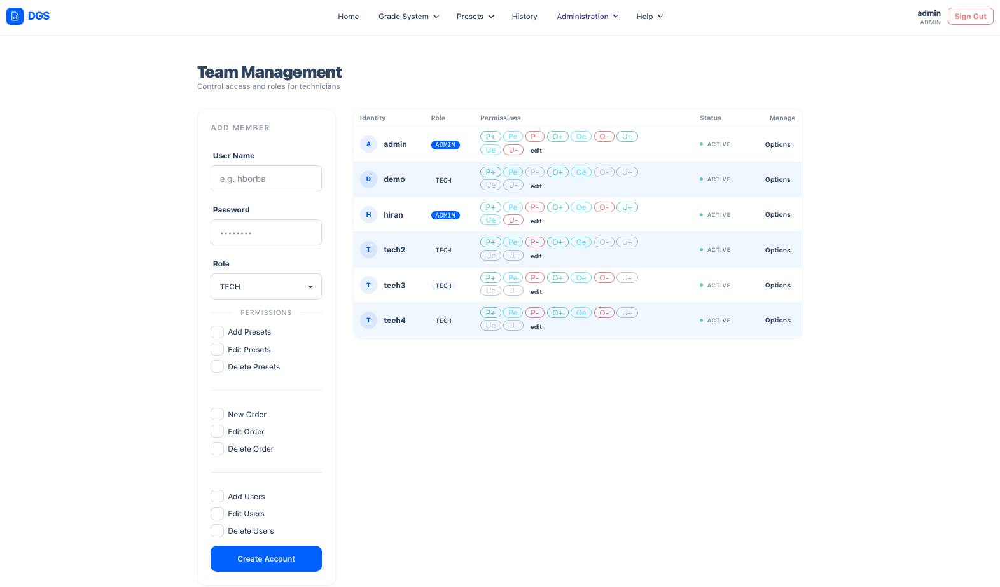
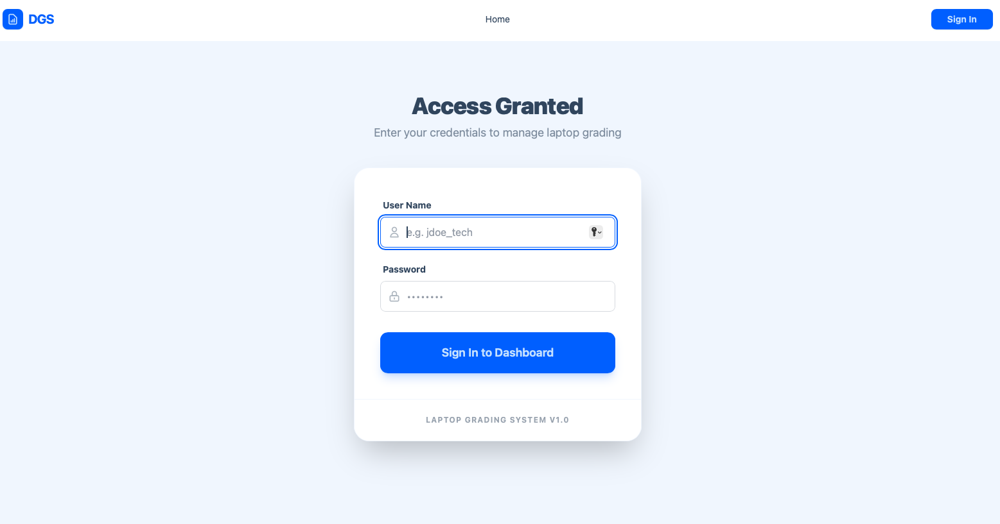

# Device Grading System (DGS)

Device Grading System (DGS) is a browser-based internal tool built to standardize grading and inspection workflows in refurbishment environments.

Instead of relying on multiple technician-maintained spreadsheets, USB handoff, and manual consolidation, DGS centralizes grading records in a single shared system with structured data, permission-based access, and exportable reporting.

## Live Demo

**Demo:** [https://dgs-demo.onrender.com](https://dgs-demo.onrender.com)

> Note: the first load may take a little longer because the demo is hosted on Render's free tier, which can spin down after inactivity.

---

## Overview

In many refurbishment workflows, technicians record device information in separate Excel files, then hand those files off for manual consolidation. This process is slow, inconsistent, and difficult to audit.

DGS was created to replace that workflow with a centralized web application where technicians and administrators can manage grading records, presets, users, and exports in one place.



---

## The Problem

In the original workflow:

- Each technician maintained a separate spreadsheet
- Device data was entered manually in inconsistent formats
- Files were transferred through USB handoff
- Results had to be merged manually into a master file
- Historical search and auditing were limited
- Reporting depended on manual cleanup and formatting

This created several operational issues:

- Duplicate work
- Data inconsistency
- Manual merge errors
- Lack of traceability
- Poor scalability as team volume increased

---

## The Solution

DGS centralizes grading into one shared browser-based platform.

It provides:

- A shared database for all grading records
- Standardized entry forms and preset-based workflows
- Role-based access for admins and technicians
- Searchable grading history
- CSV and Excel export support
- Structured order-based organization for device batches

---

## Key Features

### Preset-Based Device Configuration

Technicians can select predefined device presets so common hardware specifications are automatically filled in. This speeds up data entry, reduces typing, and improves consistency across the team.

### Advanced Grading Workflow

The grading interface captures both hardware configuration and inspection details in a structured form, including:

- Serial number
- Battery health percentage
- Touchscreen status
- Keyboard layout
- Cosmetic and functional observations
- Order association for grouped processing

Quick-insert observation buttons are also available to accelerate common notes and standardize wording during grading.





### Searchable History and Reporting

The history module supports advanced filtering across inspection records, making it easier to review processed units and retrieve specific results.

Available filters include:

- Order name / order ID
- Serial number
- Technician
- Model preset
- Date range

Search results can also be exported to:

- CSV
- Excel (.xlsx)

This makes the system useful not only for daily operations, but also for reporting and audit-ready documentation.



### Preset Management

Administrators can define reusable hardware presets to support faster grading.

A preset can include:

- Brand
- Model
- Chassis type
- CPU
- RAM
- SSD
- Touchscreen status
- Keyboard layout
- Default observations

This allows the grading workflow to start from a known baseline while still supporting overrides when a unit differs from the standard configuration.



### User and Permission Management

DGS includes database-backed user management with role-based access control.

Accounts can be created with different roles and permissions, allowing the system to separate everyday technician workflows from administrative controls.

Examples of managed access include:

- Add / edit / delete presets
- Create / edit / delete orders
- Add / edit / delete users

Roles currently include:

- **ADMIN** — elevated privileges for system administration
- **TECH** — standard operational access for grading tasks

This improves security, reduces accidental changes, and supports controlled adoption across teams.



### Secure Login

Access to the application is protected through authenticated login and encrypted password handling.

The login screen provides a clean entry point for authorized users while keeping the system restricted to approved personnel.



---

## Technology Stack

### Backend
- Node.js
- Express.js
- Sequelize ORM

### Database
- PostgreSQL for production
- SQLite for local development

### Frontend
- EJS
- Tailwind CSS
- DaisyUI

### Authentication & Security
- Session-based authentication
- bcrypt password hashing
- Role and permission management

### Hosting
- Render for application hosting
- Neon for PostgreSQL database hosting

---

## Architecture

```text
Technician Workstation (Browser)
            ↓
     Node.js / Express App
            ↓
 Centralized Database (PostgreSQL)
```

Because DGS runs entirely in the browser, it works well in restricted workstation environments where local software installation is limited or unavailable.

---

## Project Status

DGS is currently under active development and has already evolved into a robust internal workflow tool.

Implemented areas include:

- Core grading workflow
- Preset-based device entry
- User and permission management
- Searchable grading history
- CSV / Excel exports
- Order-based device grouping

Planned future improvements may include:

- Reporting dashboards and operational metrics
- Additional analytics and summaries
- More workflow automation
- Further UI and usability refinements

---

## Running Locally

### Requirements

- Node.js 18+
- SQLite or PostgreSQL

### Environment Variables

Create a `.env` file:

```bash
PGHOST=your-db-host
PGDATABASE=your-db-name
PGUSER=your-db-user
PGPASSWORD=your-db-password
SESSIONSECRET=your-random-session-secret
INITIAL_ADMIN_USER=your-admin-username
INITIAL_ADMIN_PASS=your-secure-password
USE_SQLITE=true
```

### Install and Run

```bash
npm install
node server.js
```

The app will run locally at:

```text
http://localhost:8080
```

---

## Why This Project Matters

DGS was designed around a real operational problem: replacing spreadsheet-based grading workflows with a faster, more consistent, and more secure centralized system.

It is both a practical internal tool and a strong example of full-stack application design focused on process improvement, usability, and real-world business value.

---

## Author

Created and maintained by  
**Hiran Tiago Lins Borba**

---

## License

This project is open source. Contributions, ideas, and feedback are welcome.
